# Rate Engine Flowchart — DB → Backend → Frontend

```mermaid
flowchart TD
    %% ─────────────────────────────────────────
    %% FRONTEND
    %% ─────────────────────────────────────────
    subgraph FE ["🖥️ FRONTEND  (React + TanStack Query)"]
        A([User fills Quote Form\nweight · destination · item type\ndims? · packaging · insurance])
        B["useRates hook\nsrc/hooks/useRates.ts\nstaleTime: 0 — always live"]
        C["POST /api/rates/calculate\nJSON body: RateRequest"]
    end

    %% ─────────────────────────────────────────
    %% BACKEND — ENTRY
    %% ─────────────────────────────────────────
    subgraph BE_ENTRY ["⚙️ BACKEND  (Hono — server/routes/rates.ts)"]
        D["Validate request\nZod schema"]
        E{"Hard limit\nchecks"}
        E_DHL["DHL blocked if:\n> 1,000 kg  OR\ndim.L > 300 cm"]
        E_UPS["UPS blocked if:\n> 70 kg"]
        F["calculateRates()\nserver/services/rate-engine/index.ts"]
    end

    %% ─────────────────────────────────────────
    %% WEIGHT CALC
    %% ─────────────────────────────────────────
    subgraph WC ["📐 STEP 0 — Chargeable Weight\nweight-calc.ts"]
        W1["volumetric = L×W×H / 5000\n(only if dims provided)"]
        W2["chargeable = max(actual, volumetric)\nrounded up to nearest 0.5 kg"]
        W3["UPS girth rule:\nL + 2W + 2H > 300 cm\n→ min 40 kg chargeable"]
    end

    %% ─────────────────────────────────────────
    %% DB LAYER — PARALLEL BATCH
    %% ─────────────────────────────────────────
    subgraph DB ["🗄️ NEON DATABASE — Single Parallel Batch (Promise.all)"]
        direction LR
        DB1["carrier_zones\nOrigin→Destination zone code\nper carrier\n⏱ Cache 30 min"]
        DB2["pickup_zones\nPickup surcharge by pincode\n⚡ No cache — live per request"]
        DB3["surcharge_config\nmargin_pct · demand_active\ndemand_per_kg · peak/surge flags\n⏱ Cache 5 min"]
        DB4["fuel_surcharges\nFSC % per carrier\n⏱ Cache 1 hour"]
        DB5["rate_card_steps\nExact price per weight breakpoint\nper carrier · zone · type\n⏱ Cache 30 min"]
        DB6["rate_card_bands\nPer-kg pricing for heavy shipments\n(DHL + UPS heavy tiers)\n⏱ Cache 30 min"]
    end

    %% ─────────────────────────────────────────
    %% PRICING PIPELINE (per carrier loop)
    %% ─────────────────────────────────────────
    subgraph LOOP ["🔄 Per-Carrier Pricing Pipeline  (DHL · FedEx · UPS)"]
        direction TB

        L0["Resolve zone code\nfrom carrier_zones"]

        L_TYPE{"Shipment type\nfallback check"}
        L_TYPE_NOTE["DHL doc > 2.0 kg → package table\nUPS doc > 5.0 kg → package table\nFedEx doc > 2.5 kg → package table"]

        L1{"Base rate\nlookup"}
        L1A["rate_card_steps\nExact weight match\n→ price_inr"]
        L1B["rate_card_bands\nAdditive: base + (kg−min)×rate\nMultiplicative: kg×rate\n(floor = base_price_inr)"]

        L2["Step 1 — Margin\nwith_margin = base × (1 + margin_pct/100)\nmargin_pct from surcharge_config\nDefault: 20%  ⚠️ not confirmed final"]

        L3["Step 2 — FSC\nfsc_inr = with_margin × fsc_pct/100\nfsc_pct from fuel_surcharges\n(fallback: DHL 29.5% · FedEx 27% · UPS 26.5%)"]

        L4["Step 3 — Demand Surcharge\n+ demand_per_kg × chargeable_kg\n(only if demand_active = true)"]

        L5["Step 4 — Carrier Extras"]
        L5_DHL["DHL:\n+ premium window\nstandard ₹0\n12pm ₹1,000\n9am ₹3,000"]
        L5_FDX["FedEx:\n+ peak surcharge\n(if peak_active)\namount from DB"]
        L5_UPS["UPS:\n+ surge fee (if surge_active)\n+ US inbound ₹230 (auto, USA only)\n+ formal clearance ₹3,150\n+ DDP ₹1,050\n+ signature ₹368\n+ remote ₹57/kg (min ₹3,150)\n+ oversize ₹9,450 (girth > 400cm)"]

        L6["Step 5 — Add-ons\n+ packaging (none ₹0 / std ₹150 / premium ₹350)\n+ insurance ₹199 (if selected)\n+ pickup surcharge (from pickup_zones)"]

        L7["Step 6 — GST\ngst_inr = pre_gst × 0.18\ntotal = round(pre_gst + gst_inr)"]

        L8["Build RateResult\n{ carrier, zone, chargeableKg, baseRate,\n  marginInr, fscInr, demandInr, extras,\n  subtotal, gst, total, deliveryDays }"]
    end

    %% ─────────────────────────────────────────
    %% RESPONSE
    %% ─────────────────────────────────────────
    subgraph RESP ["📤 Response"]
        R1["Sort results by totalInr ASC\n(cheapest first)"]
        R2["Return RateResult[]\nto frontend"]
    end

    subgraph FE_OUT ["🖥️ FRONTEND — Display"]
        OUT1["Render quote cards\nDHL · FedEx · UPS\nshowing total, delivery days"]
        OUT2["Customer selects quote\n→ proceeds to booking"]
    end

    %% ─────────────────────────────────────────
    %% CONNECTIONS
    %% ─────────────────────────────────────────
    A --> B --> C --> D --> E
    E -->|DHL check| E_DHL
    E -->|UPS check| E_UPS
    E -->|passes| F
    E_DHL -->|blocked| BLOCKED([Return empty — no DHL quote])
    E_UPS  -->|blocked| BLOCKED2([Return empty — no UPS quote])

    F --> W1 --> W2
    W2 -->|UPS + dims| W3
    W2 --> DB
    W3 --> DB

    DB --> DB1 & DB2 & DB3 & DB4 & DB5 & DB6
    DB1 & DB2 & DB3 & DB4 & DB5 & DB6 --> L0

    L0 --> L_TYPE --> L_TYPE_NOTE --> L1
    L1 -->|weight in steps table| L1A
    L1 -->|heavy / not in steps| L1B
    L1A --> L2
    L1B --> L2
    L2 --> L3 --> L4 --> L5
    L5 --> L5_DHL & L5_FDX & L5_UPS
    L5_DHL & L5_FDX & L5_UPS --> L6 --> L7 --> L8

    L8 --> R1 --> R2 --> OUT1 --> OUT2

    %% ─────────────────────────────────────────
    %% STYLES
    %% ─────────────────────────────────────────
    style FE       fill:#dbeafe,stroke:#3b82f6,color:#1e3a8a
    style BE_ENTRY fill:#fef9c3,stroke:#ca8a04,color:#713f12
    style WC       fill:#f0fdf4,stroke:#16a34a,color:#14532d
    style DB       fill:#fdf4ff,stroke:#a855f7,color:#581c87
    style LOOP     fill:#fff7ed,stroke:#ea580c,color:#7c2d12
    style RESP     fill:#f0fdf4,stroke:#16a34a,color:#14532d
    style FE_OUT   fill:#dbeafe,stroke:#3b82f6,color:#1e3a8a
    style BLOCKED  fill:#fee2e2,stroke:#dc2626,color:#7f1d1d
    style BLOCKED2 fill:#fee2e2,stroke:#dc2626,color:#7f1d1d
```



## Quick Reference — Pricing Formula

```
chargeable_kg  = ceil(max(actual_kg, volumetric_kg) × 2) / 2

base_rate      = rate_card_steps[carrier][zone][type][chargeable_kg]
                 OR rate_card_bands calculation (heavy shipments)

with_margin    = base_rate × (1 + margin_pct / 100)
fsc_inr        = with_margin × (fsc_pct / 100)

pre_gst        = with_margin
               + fsc_inr
               + demand_per_kg × chargeable_kg   (if demand_active)
               + carrier extras (DHL window / FedEx peak / UPS fixed)
               + pickup_surcharge
               + packaging_inr
               + insurance_inr

gst_inr        = pre_gst × 0.18
total          = round(pre_gst + gst_inr)
```

## Cache TTLs

| Data | Table | TTL |
|------|-------|-----|
| Zone codes | `carrier_zones` | 30 min |
| Rate steps | `rate_card_steps` | 30 min |
| Rate bands | `rate_card_bands` | 30 min |
| FSC % | `fuel_surcharges` | 1 hour |
| Margin / demand / peak / surge | `surcharge_config` | 5 min |
| Pickup surcharge | `pickup_zones` | **No cache** |

## What's NOT Applied Yet (Deferred)

| Feature | Reason |
|---------|--------|
| Item type discounts | Client hasn't confirmed discount % per type |
| Membership discount | Client hasn't confirmed discount structure |
| Volumetric divisor confirmation | Carrier account managers haven't confirmed 5000 |
| FedEx IPF zone corrections | Client needs to provide IPF-specific zone PDF |
